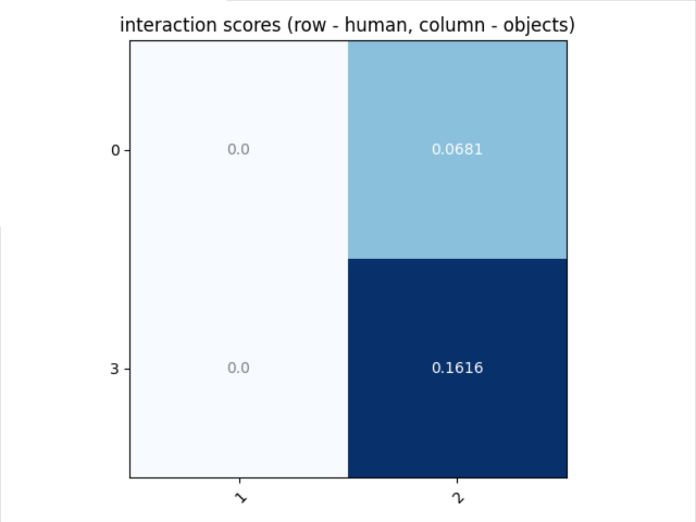

## Image Recognition Using Artificial Intelligence

### Human-Object Interaction (HOI) Detection in Workplace

The project applied transfer Learning using Spatially Conditioning Graph (SCG) model pre-trained on HICO-DET. SCG model is a two-stage HOI detection model. It utilises off-the-shelf object detection model in the first stage to generate the human and object instances. Then, the instances are used as the inputs for HOI classification in the second stage. More information about SCG model can be found on [GitHub-Spatially-Conditionally-Graph] (https://github.com/fredzzhang/spatially-conditioned-graphs).

To extend HOI detection application to factory workplace, a new industrial dataset,Human Interaction with Factory Objects (HIFO) dataset, was built to introduce 9 new interaction classes fthat common for the context.

## Table of Contents

- [Environment](#1-environment)
- [HIFO dataset](#2-hifo-dataset)
- [Train detector to generate detection](#3-train-detector-to-generate-detection)
- [Testing](#4-testing)
- [Training](#5-training-scg)
- [Demostration using GUI](#6-demostration-using-gui)

## 1. Environment

Install Python 3.8.8 with Anaconda3

Install the lightweight deep learning library [Pocket](https://github.com/fredzzhang/pocket)

Make sure the environment you created for Pocket is activated. 
```bash
conda activate pocket
```
Install a Python library for image augmentation [Albumentation](https://github.com/albumentations-team/albumentations) 
```bash
pip install -U albumentations 
```
Download checkpoints for Spatially-Conditionally-Graph model pretrained on HICO-DET [pre-trained-SCG](https://drive.google.com/file/d/1cRYKxHbS1WjKfCtVSwncYlIe0aakw3Mo/view?usp=sharing) and move it to the checkpoint folder

## 2. HIFO dataset

Download the dataset from [HIFO_data](https://drive.google.com/drive/folders/1wOKlJ9BZeyU78wucRgQ16fmr-QHPGYVZ?usp=sharing). HIFO dataset consists of 1174 images with following classes:

| Object Class | HOI Class |
| ---- | ---- |
| Pallet-truck | Pull Pallet-truck |
| Ball-bearing | Hold Ball-bearing, Collect Ball-bearing |
| Ball-bearing Group | Inspect Ball-bearing Group |
| Nitirle-gloves | Wear Nitirle-gloves |
| Box | Move Box |
| Cart | Push Cart|
| Machine | Press-on Machine |
| Lay | Lay Plastic |

## 3. Train detector to generate detection

### Finetune a Faster R-CNN detector pre-trained on MS COCO
Finetune on HIFO train set.
```bash
cd /path/to/spatially-conditioned-graphs/hicodet/detections
python train_detect.py
```
use the argument `--cache-dir` to specify the location for saving the checkpoint path, use the argument `--net` to select fastner RCNN  between resnet50 (`--net resnet`) and mobileNet-v3 (`--net mobilenetv3`). For more details of the use of arguments, run `python train_detector.py --help`.

### Generate detections using Faster R-CNN
A Faster R-CNN model pre-trained on MS COCO will be used by default to generate detections. 
```bash
python preprocessing.py --partition train, python preprocessing.py --partition test
```
Use the argument `--ckpt-path` to load the model from specified checkpoint, Use the argument `--partition` to specify the subset to run the detector on. Apply the `preprocessing.py` to both train and test dataset to generate the detections results. For more details of the use of arguments, run `python preprocessing.py --help`.
The generated detections will be saved in a directory named after the parition e.g. `train` or `test`. The detections results for each image, including object boxes, bounding boxes coordinates and scores, are stored in a JSON file.

Alternatively, the detections generated for this work can be found at 
```bash
cd /path/to/spatially-conditioned-graphs/hicodet/detections/hifo_data_preprocessing 
```

### Visualise the detections
Visualise detections for an image. The name of corresponding image file will also be printed.
```bash
cd /path/to/spatially-conditioned-graphs/hicodet/detections
python visualise.py --detection-root ./test2015 --partition test2015 --image-idx 3000
Image name:  HICO_test2015_00003102.jpg
```
Use argument `--detection-root` to specify the directory of generated detection files and `--partition` to specify the subset. To select a specific image, use the argument `--image-idx`. For more details of the use of arguments, run `python visualise.py --help`.

### (Optional) Evaluate detections for diagosis
```bash
cd /path/to/spatially-conditioned-graphs/hicodet/detections
python eval_detections.py --detection-root ./test
```
Evaluate the mAP of the detections against the ground truth object detections of HIFO. Use the argument `--partition` to specify the subset to evaluate against. The default is `test`. Use the argument `--detection-root` to point to the directory where detection results are saved. This evaluation should only be used a diagnostic tool. 

## 4. Testing

### Test the fine-tuned SCG model
Download checkpoints for this work from [SCG-workplace](https://drive.google.com/file/d/1iMMJG8TU8_x-rnHXgpMcRN-eoNyh0J6f/view?usp=sharing) and move it to the checkpoint folder
```bash
cd /path/to/spatially-conditioned-graphs
CUDA_VISIBLE_DEVICES=0 
python test.py --model-path checkpoints/hifo_hoi_hico-finetunede_epoch-16_nms-0.4_ohem-loss_update.pt
```
Use the argument `--detection-dir` to specify the sources of detections. Testing will be done on the test set and print the mAP result. For more details of the use of arguments, run `python test.py --help`.


## 5. Training SCG

### Fine-tuning pretrained SCG model on HIFO
```bash
cd /path/to/spatially-conditioned-graphs
python main.py --world-size 3 --cache-dir checkpoints/hifo >>log
```
By default, the training ran on a randomly initiated model. In this work, __the SCG model pre-trained on HICO-Det is used for transfer learning__, by specifiying `--checkpoint-path checkpoints/scg_1e-4_b32h16e7_hicodet_e2e.pt`

Specify the number of GPUs to use with the argument `--world-size`. The provided model was trained with 3 GeForce GTX 1080T GPUs (i.e. `--world-size 3`). The default sub-batch size is `4` (per GPU). resulted in an effective batch size of `32`. __Reducing the effective batch size could result in slightly inferior performance__. It is recommended to save the training log (as indicated by `>>log`). (optional) Fine-tune for negative example supporessing, by specifying hyerparameters such as `--box-nms-thresh`, `--max-objects`, `--box-score-thresh`. The work used `--box-nms-thresh 0.4`.

By default, checkpoints will be saved under `checkpoints` in the current directory. By using a validation set split from the training set, it shows that the model at epoch `12` generally provided the best model be picked. This might be different if using different GPU setup or training hyperparameters. 


## 6. Demostration using GUI
visualize the HOI detection results with python tkinter GUI
``` bash
cd /path/to/spatially-conditioned-graphs
python GUI.py
```
click on 'open file' to select an image from local HIFO dataset. After that, click on 'HOI detection' to generate the results. he script visualises detected boxes in an image with indices overlayed, and outputs the predicted scores for each action and each box pair with a valid object. Use the argument `--index` to change images and `--detection-dir` to change the source of detections.

### Plot adjacency matrix
```bash
cd /path/to/spatially-conditioned-graphs
python heatmap_generator.py
```
The script requires manual inputs to generate the adjacency matrix in the heatmap format. Indicates the indices for human and object instances accordingly. Human corresponds to the rows and objects corresponds to the column factors. E.g.:
```bash
human = ['0', '3']
objects = ['1', '2']
```
Next, fill in the scores for each human-object pair row by row. E.g.:
```bash 
score = np.array([  [0, 0.0681],    #row 1, corresponding to human indice '0'
                    [0, 0.1616]     #row 2, coressponding to human indice '3'
                    ])
```
The above will display image: # ssshirin-AY21-22_FYP_HOI-Detection-in-Workplace
